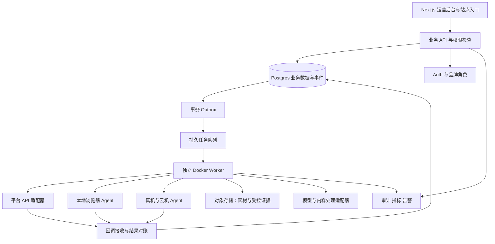
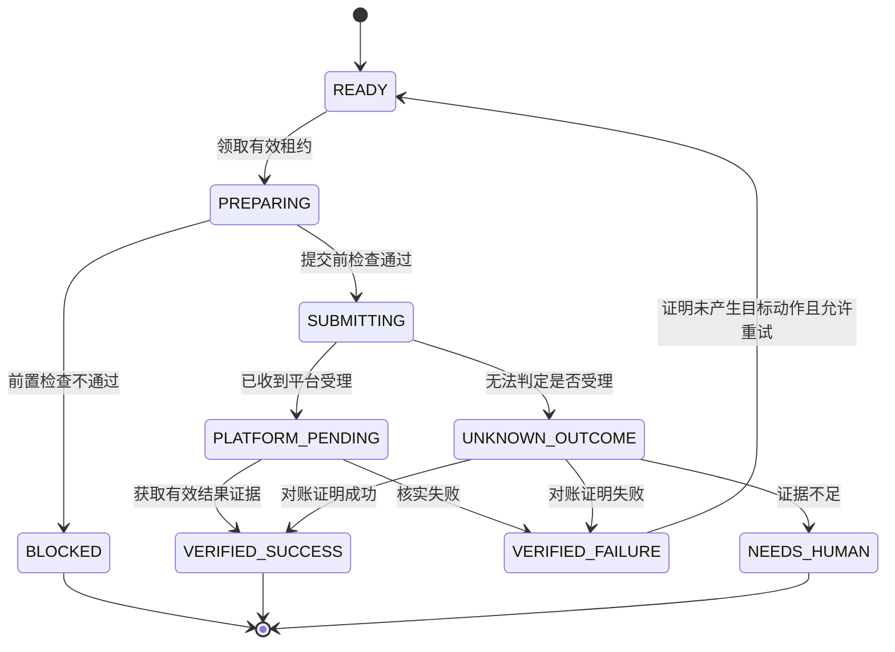

# KFF 项目规划：客番番完整业务链复刻与增强

> 版本：v1.0｜编制日期：2026-09-11｜文档状态：待实施规划  
> 项目代号：KFF，正式产品名称待定。  
> 本文用于统一产品范围、工程边界、开发顺序和验收标准，可作为后续 Codex 开发入口。本文不代表功能已经开发、第三方权限已经取得或设备已经通过验证。

## 1. 项目结论与资料边界

### 1.1 要建设的产品

KFF 是面向多品牌、多账号运营团队的获客与客户经营工作台，覆盖 **账号与环境管理 → 数据获取与线索分析 → 内容生产 → 任务执行 → 客户接待 → 客户管理 → 订单与交付 → 经营复盘**。浏览器、手机和云机是执行端；线索、内容、任务、会话与订单是统一业务对象。

完整复刻的含义是逐项覆盖可验证的业务能力，并自行实现相应系统。首条业务链跑通后，继续补齐采集、其他平台、浏览器和设备能力，不把首期版本当作最终完整产品。

三个优先改进点：

1. **消除数据搬运**：保留 Excel 兼容，增加采集结果直接建线索、建任务的流程，并保留来源、用途与去重信息。
2. **结果可核实**：分别记录任务结束、动作提交、平台受理、结果核实、消息送达、客户回复及实际成交。
3. **经营链路连续**：内容、活动、客户、会话、订单和交付能够关联，运营人员能追查来源、成本和处理过程。

### 1.2 本次实际读取与检查范围

| 资料或环境 | 本次状态 | 可以作为何种依据 |
| --- | --- | --- |
| [《分析视频产品复刻方案》对话](https://chatgpt.com/c/6aa3d8b4-5adc-83e8-a9c6-462c2186e766) | 已读取当前对话分支中显示的用户需求及完整助手答复 | 产品范围、原分析判断和设计建议的主要来源 |
| 对话所附 `2026-09-11 17-57-53.mp4` | 本次未直接观看原视频 | 视频时间点和画面描述均为原对话转述 |
| 对话所附《【客番番】产品介绍(3).pdf》《产品优势及售后服务.doc》 | 本次未直接读取附件正文 | 厂商功能和性能声明采用原对话转述，不视为独立验证 |
| 原对话的完整执行 ZIP、技术规划、验收台账、启动文件 | 已见附件入口；ZIP 下载被浏览器阻止，未取得文件内容 | 不声称已审阅包内文件或核对原始逐项编号 |
| 当前 `C:\Users\17731\Documents\ChatGPT\KFF` | 初始只有 `.git`，`master` 无提交；未发现应用代码、项目 Markdown 或包管理文件 | 本工作区是待启动仓库，不存在可据此认定已完成的业务模块 |
| 当前目录及父目录的 `AGENTS.md` | 检查的父目录链中未找到 | 后续接入其他仓库时仍须重新读取其项目规则 |

原对话称执行包含 **110 项主需求、53 项子规格、20 个工作区、47 个工作包、90 项验收、25 段视频证据、13 个接口操作、12 份 JSON Schema、91 个文件**。这些数字是对话中的交付声明，本次尚未逐项核验。

本文自行建立 `MOD-*` 模块、`UI-*` 页面、`PLAN-*` 工作包和 `ACC-*` 验收编号，**不是原附件编号的延续或替代映射**。取得原包后，应建立对应关系，保留其中的额外需求和验收，不因本文重新编排而删除范围。

### 1.3 阅读规则

- **对话明确方向**：来自用户原始完整复刻目标，或原分析明确列出的业务范围。
- **原方案建议**：例如 Next.js、Supabase、独立 Worker、分期实施；尚不等于用户最终选型。
- **本次工程建议**：本文为使开发可执行而补充的字段、接口、工作包、质量目标与治理机制。
- **待验证**：平台资格、真实账号、供应商接口、设备兼容性、存量代码、运行能力和成本。

除明确标注为本次本地检查或官方文档核查的事实，后文均是拟建产品的设计要求。任何“支持某平台”的状态都必须附带动作范围和证据。

## 2. 对原产品的理解与证据分级

### 2.1 原分析描述的主要操作链

```text
输入采集目标
  → 获取小组、成员、用户或评论结果
  → 导出 Excel
  → 人工复制链接、ID 或用户名
  → 打开 RPA 模板
  → 选择浏览器分组和素材
  → 多浏览器执行
  → 查看批次及任务记录
```

由此可见，采集台、素材库、环境分组和任务模板是产品基础；值得加强的是这些环节之间的数据关系，以及执行后的真实业务结果。

### 2.2 对话转述的录像观察

原分析称视频约 28 分 22 秒，按约 5 秒建立 341 个关键帧索引，未完成音频逐字核验。本次不把这一分析过程写成本次已执行的工作。

| 原对话中的约略时间 | 转述的可见内容 | 对规划的意义与证据限制 |
| --- | --- | --- |
| 00:40–03:25 | FB 小组结果、Excel、复制链接、小组发帖模板、多浏览器执行 | 需要采集结果、素材选择、任务配置和执行器；不据此证明每条发布成功 |
| 03:30–05:55 | 成员结果 210 条、11 页，搬运用户标识到私信任务 | 需要分页、结果管理和目标转换；210 条不等于该片段新增量 |
| 约 06:02 | 总计 2792、完成 341、错误拦截 772、取消 1679 | 三分类合计一致；不能将错误拦截等同封号、完成等同送达 |
| 07:10–08:00 | Facebook、Instagram、YouTube、Threads、WhatsApp 入口 | 入口存在不足以证明各平台全部动作已经实现 |
| 09:50–18:55 | FB 页面、Reels、素材、评论任务，多处人工导航 | 需要区分人工辅助、自动执行与验证通过 |
| 19:00–19:25 | 浏览器分组、平台、环境数量、编号池 | 证明的是库存管理界面，不能推导千环境并发 |
| 21:25–24:55 | IG 用户、粉丝、Reels 评论结果及导出 | 保留不同对象的查询与结果工作台；来源、完整性和许可待核验 |
| 25:00–26:55 | IG 指定用户私信配置、多浏览器消息界面 | 配置与气泡不能单独证明送达、已读或有效询盘 |

原分析特别指出：约 26:12 的“开启通知”是普通提示；部分绿色“执行完成”批次内部成功为 0。本文将这些问题转化为明确的状态和统计设计，不进行超出材料的竞品效果判断。

### 2.3 保留但不能直接认定可用的能力

原对话转述资料提及 AI 驾驶舱、收集客户回复、自动回复、AIGC、视频裂变分割、SCRM、iOS 真机智控、云机、硬件盒子和设备矩阵。这些进入完整范围，按真实接口和设备分别验证。

“1000+ 账号”“一小时 10 万条数据”“24 小时运行”“至少 8 人售后”等，分别涉及容量、数据源、稳定性和人员服务。它们不构成竞品已实测成绩，也不自动成为本项目承诺。

## 3. 目标、用户与业务边界

### 3.1 项目目标

| 目标 | 对用户产生的结果 | 衡量方式 |
| --- | --- | --- |
| 工作集中 | 一个工作台处理账号、内容、线索、执行与客户 | 完成主流程所需系统切换、复制粘贴次数 |
| 过程可控 | 能查看进度、暂停任务、处理异常、转人工 | 未处理异常年龄、恢复时间、错误账号执行次数 |
| 数据可信 | 每个“成功”有准确语义和相应证据 | 核实成功率、未知结果比例、对账差异 |
| 客户连续 | 线索到成交和交付保持同一关系链 | 来源覆盖率、重复客户率、询盘与订单关联率 |
| 可扩展 | 新平台和设备接入不重写业务中枢 | 适配器隔离程度、合同测试覆盖和升级影响 |

业务成效优先观察有效询盘、付费客户、已核实收入、交付时效、退款和人工处理时间。任务数、发送数、窗口数作为过程指标。

### 3.2 首期使用假设

本次建议先服务自有运营团队，在数据层保留组织、品牌和成员权限，避免首期额外建设公开 SaaS 的订阅计费、经销商和复杂多级代理体系。若后续明确对外销售，再增加商业化产品层。

首条业务链采用原方案建议的自有视频与主动咨询场景；具体业务品类、商品价格、服务承诺和报告格式由业务配置决定，不硬编码原聊天提到的业务话题或报价。

### 3.3 角色与职责

| 角色 | 主要操作 | 权限边界 |
| --- | --- | --- |
| 组织管理员 | 成员、品牌、配置、连接器和配额 | 管理权限与日常业务操作分别授权 |
| 品牌负责人 | 运营目标、预算、账号分配、重点审批 | 只管理所属品牌 |
| 内容运营 | 上传素材、生成内容、编辑任务 | 可准备草稿；提交权限依角色与既有批准范围 |
| 数据运营 | 创建查询、清洗结果、处理线索 | 只访问允许的数据源、字段与用途 |
| 客服 / 销售 | 收件、接管、客户跟进、建订单 | 受客户分配和会话控制权约束 |
| 审核人员 | 审核内容、任务、自动回复范围 | 能查看批准对象和版本；操作保留审计 |
| 运维人员 | Worker、Agent、设备、告警与恢复 | 默认不查看明文凭据或非必要客户内容 |
| 财务 / 交付人员 | 对账、退款处理、交付与异常 | 财务事件、交付动作按岗位区分 |

审批流程应可按角色、动作、金额和既有授权配置；草稿、读取、正常编辑不应被重复确认打断。需要审核的动作在形成具体内容、账号、目标和预算后统一呈现。

### 3.4 完整范围与暂不建设范围

**完整范围**：12 个模块、下述平台与设备能力的逐项登记、真实流程验证、运营与售后工具。

**首期暂不建设**：自研浏览器内核、通用任意脚本执行平台、自建云手机基础设施、未经容量验证的千设备采购、独立于现有系统的第二套 CRM / 支付 / 身份中心、与业务闭环无关的复杂插件市场。

对于无法取得资格或没有接口的能力，保留 `BLOCKED`、原因、负责人和下一步。人工辅助版本可提供使用价值，但不计为对应自动化验收通过。

## 4. 完整产品范围：12 个模块

| 编号 | 模块 | 主要功能 | 完成标准 |
| --- | --- | --- | --- |
| MOD-01 | 账号中心 | 多平台账号、负责人、分组、授权、权限、会话状态、停用 | 身份准确、权限可追溯、失效及时呈现，不串账号 |
| MOD-02 | 环境中心 | 独立会话、宿主机、网络引用、分组、运行占用、恢复 | 一个环境同时只有一个有效执行者，状态和心跳一致 |
| MOD-03 | 数据获取 | 对象查询、分页增量、字段映射、导入导出、来源、去重 | 数据、游标、来源可恢复；覆盖与用途可解释 |
| MOD-04 | 线索分析 | 需求识别、证据、排序、人工改判、资格检查 | 推断与事实区分，意向分不能替代联系资格 |
| MOD-05 | 素材与内容 | 文案、图片、视频、切片、字幕、翻译、变体和审批 | 原始素材、内容版本、渲染产物和发布记录可追溯 |
| MOD-06 | 任务编排 | 模板、目标账号快照、计划、审批、预算、调度、停止 | 可重复调用、可恢复、可核实，不盲目重复产生外部动作 |
| MOD-07 | 浏览器执行 | 本地 Agent、RPA、多窗口、步骤日志、人工接管 | 账号目标核对可靠，结构变化和验证场景能明确停止 |
| MOD-08 | 设备矩阵 | Android、iOS、云机、硬件盒子、预览、媒体推送、控制 | 真实型号和接口测试通过，掉线不导致重复未知动作 |
| MOD-09 | AI 驾驶舱 | 统一收件箱、知识库、问题整理、回复草稿、有限自动回复 | 信息有依据，接管一致，过期草稿不能晚到发送 |
| MOD-10 | SCRM | 客户档案、身份、来源、分配、阶段、跟进、会话与交付关联 | 同一品牌内关系连续，跨平台身份不随意合并 |
| MOD-11 | 网站与成交 | 落地页、站内聊天、WhatsApp 入口、订单、支付、退款、报告交付 | 真实资金状态与订单对账，点击和成功页不冒充成交 |
| MOD-12 | 运营与服务 | 漏斗、成本、能力状态、工单、培训、版本升级、运行手册 | 指标口径一致；运维恢复和服务责任可执行 |

## 5. 核心业务流程

### 5.1 首条端到端业务链


每一步记录业务对象 ID 和事件 ID。平台无法提供完整来源时保留“未知来源”，不通过昵称、时间接近等弱证据强行归因。

### 5.2 采集到运营任务

1. 选择平台、对象类型、允许的数据源、字段和用途，输入目标。
2. 预检目标、账号资格、预计量和重复查询，创建可恢复查询。
3. 获取一页结果，清洗并保存观察记录、来源和下一页游标。
4. 在结果台筛选、人工修正、导出，或选择“建立线索 / 创建任务”。
5. 创建任务时展示去重结果、联系资格、排除对象和排除原因。
6. 固化账号、目标、素材版本、预算和时间，形成可审核任务。
7. 执行后回写结果及证据，保留原查询与线索关系。

### 5.3 客户回复与人工接管

1. Webhook 或允许的读取方式接收消息，校验来源并去重。
2. 依据品牌和远端身份归入会话，更新客户服务窗口及负责人。
3. AI 整理需求，检索有效知识，生成包含依据的草稿。
4. 人工发送，或在明确配置的低风险范围内自动发送。
5. 接管时递增会话版本；旧版本的生成任务和发送任务失效。
6. 建订单、标记询盘、更新跟进，并将动作与操作者写入审计。

### 5.4 异常到恢复

异常先分类为授权、页面变化、设备、配额、策略、网络或结果未知。准备步骤可有限重试；提交结果不确定时先对账。需要人工时展示当前步骤、已执行动作、证据和允许的恢复入口，人工操作后继续使用原任务关系，避免另建无法追踪的临时任务。

## 6. 页面与交互规划：20 个工作区

以下页面划分是本次重构的信息架构，不声称与原附件 20 页逐项一致。路由是候选命名，可随最终仓库约定调整。

| 编号 / 工作区 | 核心信息 | 主要操作与特殊状态 |
| --- | --- | --- |
| UI-01 账号 `/accounts` | 平台、账号身份、品牌、负责人、分组、授权范围、最近核验 | 连接、分配、分组、停用、重新授权；区分已连接、无能力、授权失效 |
| UI-02 环境 `/environments` | 环境 ID、账号、宿主、版本、网络引用、租约、心跳 | 创建或接入环境、启动停止、绑定；占用、离线、版本不兼容 |
| UI-03 查询 `/collections` | 平台对象、数据源、输入、字段、用途、数量、游标 | 预检、执行、暂停、恢复、增量；部分完成、来源不可用 |
| UI-04 结果 `/collection-results` | 原始 ID、链接、观察时间、字段、来源、去重标记 | 过滤、映射、导入导出、建线索、建任务；明确有效与排除数量 |
| UI-05 线索 `/leads` | 原文、需求标签、证据、排序、资格、负责人 | 改判、分配、更新阶段、转客户；未知信息、重复候选 |
| UI-06 素材 `/assets` | 原文件、权属、语言、格式、哈希、版本、处理状态 | 上传、预览、分类、归档、启动处理；上传失败、权属未补、渲染失败 |
| UI-07 内容 `/content` | 草稿、渠道版本、字幕、封面、来源片段、审核状态 | 编辑、生成变体、对比、审核、创建发布；过期版本、平台规格不符 |
| UI-08 模板 `/templates` | 平台动作、输入结构、模板版本、步骤、能力要求 | 配置、版本化、预演、启停；待验证、已弃用、适配失败 |
| UI-09 任务编辑 `/tasks/new` | 账号目标快照、排除项、素材、预算、时间、预计工作量 | 预检、存草稿、申请审核、创建；禁止隐式换账号与换素材 |
| UI-10 计划 `/schedules` | 时区、执行日历、触发规则、预算、错过执行策略 | 调整、暂停、恢复；夏令时冲突、延迟、积压 |
| UI-11 审核 `/approvals` | 具体账号目标、文案、附件、用途、预算、版本差异 | 批准、驳回、撤回；对象修改或授权过期后显示失效 |
| UI-12 运行墙 `/runs/live` | 当前步骤、账号、环境、设备、心跳、等待原因 | 暂停、取消、接管、查看证据；区分请求停止和已经停止 |
| UI-13 历史与对账 `/runs/history` | 批次汇总、动作结果、尝试、远端 ID、证据 | 筛选、对账、恢复、导出；未知结果与失败独立显示 |
| UI-14 收件箱 `/inbox` | 品牌、渠道、客户、窗口、负责人、消息、AI 依据 | 回复、草稿、接管、转交、退订处理；多人冲突、AI 草稿过期 |
| UI-15 客户 `/customers` | 身份、来源、跟进、会话、订单、交付时间线 | 建档、分配、备注、候选合并与撤销；权限隔离、关系冲突 |
| UI-16 活动与归因 `/campaigns` | 内容账号、渠道链接、触点、询盘、订单、成本 | 创建活动、生成来源链接、查看证据；未知来源、迟到事件 |
| UI-17 订单与交付 `/orders` | 商品快照、金额币种、支付、退款、交付版本 | 建订单、核对、发起获准处理、交付；支付待核实、退款中、交付失败 |
| UI-18 设备 `/devices` | 类型、供应商、型号版本、账号、预览、租约、当前任务 | 注册、分组、推送素材、控制、接管；断线、签名或兼容性失效 |
| UI-19 运营与服务 `/operations` | 漏斗、成本、异常、工单、培训、升级 | 分派问题、看趋势、恢复演练；数据延迟、指标缺口、版本回退 |
| UI-20 设置与能力 `/settings` | 组织品牌、角色、连接器、知识库、策略、预算、审计 | 配置和版本管理；能力待验证、资格缺失、配置冲突 |

所有页面统一支持加载、空数据、局部失败、无权限、授权失效、数据陈旧与可恢复错误。关键统计必须显示时间范围、品牌、时区、数据更新时间和口径说明。

### 6.1 必备子页面与详情入口

20 个工作区是导航分组，不限制实际页面数量。以下子页必须随对应模块交付，避免只做总览而遗漏实际操作入口。

| 归属工作区 | 必备子页或详情 |
| --- | --- |
| UI-16 活动与归因 | 落地页列表、编辑、预览、发布状态、来源链接和触点详情 |
| UI-01 / UI-20 | WhatsApp 号码池、号码分配与分流规则；分流记录关联 UI-16，接收状态关联 UI-14 |
| UI-07 / UI-11 / UI-13 | 内容版本比较、素材血缘、内容审核、渠道目标、单次发布结果与远端对象 |
| UI-17 订单与交付 | 支付详情、退款与对账、报告生成/版本、交付记录、访问范围和失效控制 |
| UI-14 / UI-20 | 站内聊天配置、知识库维护、回复策略、自动回复资格、接管与转交记录 |
| UI-02 / UI-18 / UI-20 | 环境详情、宿主 Agent、网络配置引用、设备配对、设备会话与兼容性 |
| UI-19 / UI-20 | 工单详情、培训资料、服务责任、版本升级、审计与角色权限 |

任意查询结果、线索、内容、运行、会话、客户、订单和活动页面均提供有关联依据的详情跳转；无直接关联时展示缺口，不生成猜测链接。

## 7. 模块细则与业务规则

### 7.1 账号与环境

- 账号平台标识、展示名称、品牌归属、负责人、授权状态分字段管理；“浏览器能打开”不能替代账号身份核验。
- 账号组支持批量分配，但任务创建或审核时生成成员快照；后续组变更不影响已经批准的任务。
- 凭据采用密钥引用；列表、任务 JSON、日志、截图索引与模型上下文不保存明文令牌、Cookie 或密码。
- 环境包含独立会话目录或正式供应商实例引用、绑定账号、宿主机、版本、网络配置引用、心跳、占用和最后异常。
- 账号、环境、设备统一申请资源租约，按固定顺序获取；竞争失败释放已获资源并重新排队，避免死锁。
- 人工接管和自动执行共享同一控制权机制，避免人在窗口操作时后台继续点击。
- 环境隔离的目标是会话、存储与身份不混用；不承诺免封或无限并发。

### 7.2 查询、结果与 Excel

- 查询最小字段：平台、对象类型、目标列表、来源类型、允许字段、用途、数量上限、时区显示设置、执行账号和增量规则。
- 数据源区分官方 API、正式供应商、自有系统、人工导入和经确认可用的浏览器读取；保存来源版本与限制。
- `source_object_id` 和其他远端 ID 一律使用字符串；导入导出不得丢失前导零或长数字精度。
- 导入流程为上传 → 字段映射 → 预览验证 → 重复/错误明细 → 确认入库；原文件保留期与访问权限可配置。
- 分页数据、去重更新、游标与 checkpoint 在一个一致性提交单元完成，崩溃后从最后确认页恢复。
- 观察记录保留 `source_url`、`observed_at`、`query_id`、`allowed_purposes`、`retention_policy`、证据版本或哈希。
- 同一对象的新观察可以更新资料，但不覆盖旧判断使用的证据版本；第三方数据保留必须服从其来源限制。
- 导出限定品牌、字段和用户权限，并处理表格公式注入；展示“本次返回量、去重后数量、已知覆盖范围”，不伪造全量覆盖率。

### 7.3 线索与客户身份

- 线索分析输入是允许处理的观察记录及其原文，输出结构包含事实、推断、证据片段、未知项、排序分和建议动作。
- 排序分只用于队列优先级；未经过真实样本校准，不展示精确“成交概率”。
- 联系资格独立判断平台能力、用途、同意或相应会话依据、退出、窗口、账号权限及预算，作为执行门槛。
- 原文中的话题兴趣不能自动扩展为疾病、财务困境或真实关系状态等事实。
- 线索、客户和平台身份分开建模。一名客户可有多个经确认身份；同名同头像仅形成候选。
- 合并记录保存操作者、证据和旧关系，支持纠错；默认禁止跨品牌自动合并或跨品牌共享客户。

### 7.4 内容与视频生产

```text
原素材入库与权属记录
→ 探测时长 / 分辨率 / 帧率 / 音轨
→ 转写与片段分析
→ 建议切点、开头、标题和渠道变体
→ 人工编辑与确定片段
→ 渲染字幕、封面、比例及语言版本
→ 质量检查
→ 内容审核或既有授权范围检查
→ 渠道发布任务
→ 发布结果与素材血缘关联
```

- 每个产物关联原文件、片段起止、字幕版本、翻译版本、渲染参数、模型/工具版本与审批记录。
- 音画同步、字幕时间、黑帧、静音、缺失音轨、尺寸与文件可播放性进入质量检查；内容可读性保留人工抽检。
- 渲染按步骤记录 checkpoint，失败只重做受影响产物；同一输入和参数使用可复用缓存键。
- 文案、图片、视频分别保留生成草稿与已批准版本；生成变体不能悄悄覆盖原稿。
- 若找到可用 Video OS，应优先复用其素材、渲染、任务和对象 ID；仅在缺失边界补模块。

### 7.5 任务模板与 RPA

- 模板是版本化工作流，声明平台、对象、动作、输入 Schema、权限、步骤、定位方式、超时、前置条件、成功证据、错误分类和恢复方式。
- 工作流优先采用确定的语义定位和平台对象核对；视觉识别可辅助定位，但不赋予模型任意脚本执行权。
- 预演只验证输入、账号、对象和步骤前置条件，不执行真实发送或发布。
- 提交前重新检查账号身份、目标、批准快照、素材哈希、资格、退订、时间、预算、租约和停止开关。
- 打开页面与填写草稿可有限重试；外部提交之后发生超时或连接断开，必须进入结果判定流程。
- 验证码、登录验证、权限变化和无法识别页面转为待人工，并明确当前是否已产生外部动作。
- FB 个人、小组、主页、Reels 与 IG 用户、帖子、Reels 等按动作各建模板验证，不能用一个平台总开关代替。

### 7.6 AI 驾驶舱与知识库

- 先上线问题整理与回复草稿，再开放经过批准的简单问答自动发送；每类自动回复都有范围、版本和退出条件。
- 知识库包含商品、当前价格、交付范围、交付时效、退款规则、禁止承诺、升级人工条件及内容有效期。
- 商品价格和可售状态从结构化商品配置读取；检索回答保存引用和知识版本。
- 检索内容、外部评论、客户消息视为数据，不具有修改系统指令、调用任意工具、读取其他客户资料或改变价格的权限。
- 无依据、知识过期、价格例外、退款争议和超出配置范围的请求转人工；缺失知识形成待补工单。
- AI 草稿携带 `conversation_epoch`、所依据的最后消息版本和有效期，发送时三者都重新校验。
- 人工接管递增 epoch 并取消待发动作；租约过期、客户新消息或权限变更也可以使草稿失效。
- 模型故障时收件箱与人工客服继续运行；自动回复预算耗尽后转草稿或人工，不中断客户收件。

### 7.7 SCRM、网站、订单与交付

- 客户阶段建议为新线索、待资格核对、可跟进、处理中、有效询盘、成交、交付中、已交付、流失或退出；阶段变化记录依据和操作者。
- 有效询盘需由业务定义，例如明确提出服务或商品需求且可继续沟通；不能由消息数量直接推导。
- WhatsApp 号码池分流、WhatsApp 个人应用、官方商业消息接入是不同功能，各有独立状态和证据。
- 站内聊天、客户身份、订单和支付若在其他真实仓库中已存在，采用明确的系统主数据和接口对接，不复制收入账本。
- 订单保存商品名称、价格、币种、交付范围与条款的创建时快照；之后商品变价不修改历史订单。
- 支付状态根据可信回调和必要的服务端查询核实，并匹配订单、金额、币种和支付对象；成功页仅用于用户展示。
- 退款支持部分退款、多次退款、进行中与失败，金额累计不能超出可退金额；异步争议和后续调整单独记录。
- 交付物有版本、收件对象、生成记录、访问权限、交付时间和失败重试状态；付款确认与交付完成独立。

### 7.8 运营与售后

- 工单关联品牌、客户或运行任务，保存分类、严重度、负责人、时限、证据与处理记录。
- 运营面板支持按平台、品牌、账号、活动、时间范围分析，显示数据延迟和缺失来源。
- 文档与培训覆盖账号授权、素材制作、任务异常、人工接管、客户跟进、账务和设备维护。
- 服务人员、响应时间、设备供应商责任、升级窗口和采购承诺由实际团队或合同确定；不能从工单模块存在推导服务已经具备。

## 8. 技术架构与选型原则

### 8.1 候选架构

下图沿用原方案方向，最终选型以 F0 存量审查和接口验证结果为准。



### 8.2 组件职责

| 组件 | 候选方案 | 明确职责 |
| --- | --- | --- |
| 前端与短请求 | TypeScript / Next.js，Web 部署候选 Vercel | 业务页面、输入验证、权限、短 API、连接器回调入口 |
| 数据与身份 | Supabase Postgres / Auth | 主数据、状态、事务、租户品牌隔离 |
| 持久队列 | 先评估 Supabase Queues | 可恢复交付和消费，结合 outbox 使用 |
| 长任务 | 独立 Docker Worker | 调度、结果对账、内容处理、连接执行器 |
| 本地执行 | 受控 Agent + Playwright 或正式环境供应商 API | 账号会话、浏览器自动化、心跳、人工接管 |
| 设备执行 | Android / iOS / 云机适配器 | 控制租约、素材推送、设备操作、结果与兼容性 |
| 媒体与证据 | R2 或既有对象存储 | 原始素材、版本产物、短期脱敏证据、受控下载 |
| AI 能力 | 供应商无关的模型适配层 | 结构化分析、检索草稿、内容建议、成本与版本追踪 |

Web 函数执行时限随平台方案及功能配置变化，部署时核验。持续浏览器会话、设备控制和大型渲染采用独立 Worker，不依赖单次 Web 请求存活。Supabase 队列保证不等于第三方动作恰好执行一次，外部动作仍需业务幂等和结果对账。

### 8.3 存量复用规则

F0 分别查找 Video OS、独立站、站内聊天、客户、订单、支付、WhatsApp 号池、队列和 Worker。每项记录真实仓库、文件路径、接口、部署状态、测试、负责人及“复用 / 扩展 / 替换 / 未找到”结论。

当前只检查了 KFF 工作区，不能据此认定用户其他项目不存在。没有可靠代码证据的模块按待核实处理；没有经过验证的接口不写成现成依赖。

不预先引入 Redis、Kafka、第二个 CRM 或第二套支付账本。新增组件需要说明现有组件无法满足的容量、恢复或隔离需求。

### 8.4 Agent 连接与升级

- Agent 主动建立经认证的出站连接，尽量不向公网暴露宿主控制端口。
- 每个 Agent 有独立身份、能力声明和短期授权；不向设备发放全库服务凭据。
- 命令限定动作类型、任务、品牌、账号、资源租约、版本、有效期和允许文件。
- 心跳记录宿主资源、执行槽位、版本和当前任务；日志中的客户内容按需脱敏。
- 升级先排空任务，兼容协议版本，保留回退包；升级中断的外部动作进入对账而非自动重发。

## 9. 可靠执行与状态设计

### 9.1 四类状态分别管理

1. **任务定义**：草稿、待审核、已批准、批准失效、已撤销。
2. **运行调度**：排队、已领取、运行中、暂停请求中、已暂停、待人工、取消请求中、已取消、已结束。
3. **单次动作结果**：准备中、已提交、平台处理中、已核实成功、已核实失败、结果未知、策略阻断、授权缺失。
4. **业务效果事件**：送达、已读、客户回复、有效询盘、支付核实、退款、交付。

后续业务效果可以晚于运行结束到达，不把已结束任务重新解释为已读或成交。



`NEEDS_HUMAN` 在自动执行状态机中停止，后续人工裁定作为显式事件处理。图中简化了取消、授权恢复、预算等待等旁路，实施时需提供完整转移表和非法转移测试。

### 9.2 幂等、Outbox 与恢复

- 创建任务接收幂等键并保存请求摘要；同键同内容返回原资源，同键不同内容返回冲突。
- 业务动作具有稳定 `action_id`，每次执行另建 `attempt_id`，远端结果另存；重试不产生新的业务意图。
- 任务/事件与 outbox 同事务提交，派发器可重复投递，消费者按事件 ID 去重。
- 领取任务采用租约与递增 fencing token；过期执行者不得续写业务状态或申请新提交。
- 提交外部动作之前记录提交意图和稳定关联 ID；第三方支持幂等键时使用，并记录其范围和有效期。
- 平台已接受但本地断网时保留 `UNKNOWN_OUTCOME`。先查远端对象、回调和相关记录；无法证明未执行时禁止自动再提交。
- “没有查到记录”不等于“确认没有执行”，需要考虑平台一致性延迟、查询范围和权限；没有可靠查询能力时转人工核验。
- 批量任务拆成每账号、每目标的业务子动作；部分成功后仅恢复符合重试条件的未完成子动作，不能整体重发。
- 租约只能约束内部控制与后续提交，无法撤销在网络中或平台已接受的请求；交接与恢复必须考虑在途动作。
- 队列续租和本地恢复不替代业务对账。超过上限的失败进入死信或人工队列，并保留重放条件。
- 回调只有在验签及必要校验通过、原始事件可靠落库后才返回接收成功；复杂业务投影异步处理，并支持受控重放。

### 9.3 批准、预算和停止

批准快照至少绑定品牌、账号集合、目标集合、动作类型、内容版本、附件哈希、用途、预算、执行窗口、策略版本。集合与内容实质变化时批准失效；普通展示字段变化不必触发无意义的重新审核。

预算使用“预占 → 结算 / 释放 → 差异调整”记录，区分货币成本、调用量和动作配额。未知结果保留预占或明确的待核算状态，不能因本地超时当作没有费用。

停止分组织、品牌、平台、账号、任务、设备多个范围。停止后禁止领取新动作，并在提交前检查生效。已经提交的在途动作继续收集结果，界面显示“停止新动作，在途 X 项”，不能宣称撤回已发生动作。

人工接管同样只能阻止尚未提交的 AI 动作。通过平台原生客户端发送的人工消息能否及时回收，会影响接管判断；该同步能力应在 F0 验证，不可假设所有外部人工操作即时可见。

### 9.4 调度与时间

时间戳存 UTC，计划保存 IANA 时区、当地规则和下一次执行点。重复计划明确夏令时重复/缺失时刻、错过执行时“跳过 / 延后 / 有上限补执行”的行为。

调度以账号、设备和平台配额为约束，按品牌公平分配槽位；设置排队超时、重试退避、配额冷却和熔断。平台限制以当前账号实际能力与官方要求为准，不靠随机延迟推导获准操作量。

## 10. 数据模型与约束

以下为逻辑实体建议，不是已执行的数据库迁移。取得现有系统后先确定每种对象的唯一主数据来源。

| 领域 | 建议实体 | 关键字段或关系 |
| --- | --- | --- |
| 组织权限 | `organizations`, `brands`, `memberships`, `role_grants` | 组织、品牌、成员、角色、授权有效期 |
| 账号能力 | `platform_accounts`, `account_groups`, `account_assignments`, `capability_checks` | 远端身份、负责人、credential_ref、动作、资格、核验时间 |
| 环境设备 | `environments`, `agents`, `devices`, `resource_leases` | 宿主、版本、账号绑定、资源、lease_until、fencing_token |
| 数据查询 | `collection_queries`, `collection_runs`, `collection_checkpoints` | 输入版本、字段、游标、覆盖量、状态 |
| 观察来源 | `observations`, `source_evidence`, `data_policies` | 来源对象、时间、证据、用途、保留规则 |
| 线索身份 | `leads`, `customer_identities`, `identity_links`, `lead_assessments` | 远端 ID、关联证据、模型版本、改判与未知项 |
| 联系依据 | `contact_permissions`, `suppressions` | 渠道、用途、依据、有效期、退出和恢复记录 |
| 素材内容 | `assets`, `asset_versions`, `content_versions`, `render_jobs`, `publications` | 哈希、血缘、语言、切点、远端发布对象 |
| 模板任务 | `workflow_versions`, `tasks`, `task_snapshots`, `task_targets`, `schedules` | 版本、不可变输入、账号目标集合、时区规则 |
| 审核执行 | `approval_decisions`, `runs`, `actions`, `action_attempts`, `action_receipts` | 批准摘要、状态、尝试、平台受理与核实证据 |
| 可靠事件 | `outbox_events`, `inbound_events`, `reconciliation_jobs` | event_id、来源、验签状态、重试、对账结果 |
| AI 与知识 | `knowledge_documents`, `knowledge_versions`, `ai_generations`, `reply_drafts` | 引用、输入摘要、模型、成本、epoch、有效期 |
| 会话客户 | `customers`, `conversations`, `messages`, `conversation_control`, `followups` | 品牌身份、远端消息、负责人、epoch、跟进阶段 |
| 经营服务 | `campaigns`, `touchpoints`, `cost_entries`, `tickets`, `audit_events` | 来源事件、费用归属、工单、操作者 |
| 成交交付 | 既有或拟建 `orders`, `payment_events`, `refunds`, `deliveries` | 商品快照、minor amount、currency、核实事件、交付版本 |

关键约束：

1. 所有业务查询和对象关联受组织与品牌范围约束；外键或服务端校验不得允许串品牌绑定。
2. 平台身份按“品牌/连接器范围 + 平台 + 外部对象 ID”管理唯一性；客户合并另行处理。
3. 收件事件按连接器及远端事件 ID 去重；业务对象按远端消息或支付对象再次去重，兼容平台重复通知不同事件 ID 的情况。
4. 同一外部事件可能乱序到达，保存发生时间与接收时间，通过事件语义更新状态，不按到达顺序简单覆盖。
5. 金额使用最小货币单位与币种；币种精度采用可维护规则，不默认全部两位小数。不同币种分开汇总，折算需记录汇率来源和日期。
6. 审计记录关键状态变化的操作者、对象、前后摘要和关联请求；不在审计里复制明文凭据。
7. 数据删除覆盖原记录、搜索/向量索引、缓存、对象存储产物和下游副本；备份按明确周期到期。
8. 高权限服务端连接不能只依赖数据库 RLS，必须验证租户、品牌和连接器归属。

## 11. 内部接口与适配器合同

### 11.1 统一接口约定

以下路径为本次拟定的内部合同草案，不是第三方接口，也不声称与原执行包的 13 个操作一致。实施时统一输出 OpenAPI / Schema，并由实际代码生成或验证。

- 写入带 `request_id`、必要的 `idempotency_key`，编辑已有资源带版本条件。
- 身份与可访问品牌来自服务端授权上下文；不能只信任客户端传入的 `brand_id`。
- 大任务创建返回资源 ID 和状态查询入口；不让 HTTP 请求等待全部执行结束。
- 错误区分输入错误、无权限、版本冲突、能力未验证、授权失效、配额、策略阻断、需人工和未知结果。
- 分页采用稳定游标，历史记录与当前状态分开读取；统一记录 UTC 时间。

| 操作 | 候选内部接口 | 输入与结果要点 |
| --- | --- | --- |
| 能力预检 | `POST /api/capability-checks` | 账号、平台对象、动作与用途 → 范围、限制、证据和有效期 |
| 创建查询 | `POST /api/collections` | 目标、字段、来源、上限 → 查询 ID、预检结果 |
| 结果转任务 | `POST /api/collection-results/task-drafts` | 结果快照、模板 → 草稿、去重与排除原因 |
| 创建任务 | `POST /api/tasks` | 模板版本、账号目标、内容、计划预算 → 任务及摘要 |
| 审核决定 | `POST /api/tasks/{id}/approval-decisions` | 具体摘要、版本、决定 → 批准记录或版本冲突 |
| 入队执行 | `POST /api/tasks/{id}/runs` | 已批准版本、触发信息 → 运行 ID |
| 请求停止 | `POST /api/runs/{id}/stop-requests` | 范围与原因 → 新动作停止状态、在途数量 |
| 获取运行 | `GET /api/runs/{id}` | 动作分页、聚合状态、证据权限 |
| 发起对账 | `POST /api/actions/{id}/reconciliations` | 未知动作 → 对账任务及结论 |
| Agent 领取/心跳 | `POST /api/agent/claims`、`POST /api/agent/heartbeats` | Agent 身份、槽位、租约版本 → 有效命令或拒绝 |
| 回报执行 | `POST /api/agent/action-reports` | 动作、尝试、fencing token、证据引用 → 条件接受 |
| 接收回调 | `POST /api/connectors/{connector}/webhooks` | 原始事件、签名 → 验签、持久化、去重后异步处理 |
| 会话接管 | `POST /api/conversations/{id}/control-transfers` | 期望 epoch、目标负责人 → 新 epoch 或冲突 |
| 回复发送 | `POST /api/conversations/{id}/reply-actions` | 草稿/内容版本、epoch、最后消息版本 → 受控动作 |
| 注册设备 | `POST /api/devices` | Agent、型号、版本、正式供应商引用 → 待验证设备 |
| 内容处理 | `POST /api/content-jobs` | 素材版本、处理参数 → 可恢复作业与产物 |

### 11.2 平台适配器共同接口

适配器至少声明 `describeCapabilities`、`validateInput`、`preflight`、`execute`、`verifyOutcome`、`normalizeEvent`，需要接收事件的适配器另声明 `verifyWebhook`。不适用的能力明确返回不支持。

每个适配器维护文档 URL 与核验日期、API/SDK 版本、账号与对象范围、权限、请求响应 Schema、配额、超时、幂等支持、错误映射、回调验签、数据保留、正反向测试和真实验证证据。

API 与浏览器是可选择的执行实现，必须各自取得对应能力验证；API 权限被拒绝后不自动切换实现继续同一动作。

## 12. 平台能力矩阵与验证顺序

能力键至少由“平台 + 账号类型 + 对象类型 + 动作 + 接入路径”组成；实例层再叠加账号、地区、授权范围与到期时间。

建议状态：`UNASSESSED` 未评估、`FEASIBLE` 路径可行但未接入、`IMPLEMENTED_TEST_ONLY` 仅本地或模拟通过、`VERIFIED_REAL` 真实范围通过、`BLOCKED` 有明确阻塞、`DEPRECATED` 已停用。界面同时显示最后核验日期及允许范围。

| 平台/能力 | 完整范围中的动作族 | 首次验证重点 |
| --- | --- | --- |
| Facebook 个人 | 自有账号资料及资料中涉及的发帖、评论、好友、消息模板 | 每类动作资格与实现路径分开，不从主页能力推导个人能力 |
| Facebook 小组 | 小组查询、成员结果、内容/评论、发帖模板 | 群组角色、数据来源与允许范围，成员结果完整性 |
| Facebook 主页 / Reels | 内容、发布、评论、符合条件的消息 | 主页权限、发布对象、评论结果和消息接入资格 |
| Instagram 内容 | 专业账号媒体、帖子、Reels 等发布与结果 | 账号类型、上传处理、最终发布、远端对象核实 |
| Instagram 数据 | 用户、粉丝、评论等查询结果工作台 | 每个对象的允许字段、来源权限与分页；不能承诺任意全量 |
| Instagram 消息 | 获准会话回复、符合条件的评论私信回复等 | 不同入口的对象、时间与次数限制分别验证；不推导任意陌生人群发 |
| TikTok 内容 | 素材交付、上传/发布与结果回收 | 应用用途、审核、公开发布资格、用户控制流程 |
| TikTok 商业消息 | 当前产品允许的商业收发链 | Business Messaging 接入、账号、地区及开放范围 |
| WhatsApp 入口 | 号码池、号码状态、链接分流、来源记录 | 点击入口只算触点，不能直接记为已收件 |
| WhatsApp 个人 App | 账号与会话管理、人工使用及设备辅助的候选动作 | 读取、发送、设备与会话限制分别核验，不能继承官方商业消息的能力状态 |
| WhatsApp 商业消息 | 接收、会话回复、模板、送达、退订、转人工 | 账号连接、同意依据、窗口、模板和状态回调 |
| YouTube | 视频相关发布、读取、评论等候选任务 | 先确定实际需要的动作，再核查授权、对象和配额 |
| Threads | 内容发布、读取、回复等候选任务 | 真实账号动作范围及审核要求 |
| X | 发布、读取、互动等候选任务 | 当前产品权限、额度、成本及所需功能范围 |
| Google 商家信息 | 商家发现、来源位置、字段引用 | 来源、缓存/保存限制、署名和可导出范围 |
| 网站 / 站内聊天 | 来源参数、主动收件、客户与订单 | 现有系统对接、身份、会话与支付事件的主数据 |

上述候选动作族用于登记待验证范围，并非宣称所有动作目前都有可用 API。第一条生产链选择 **当前真实账号可验证、业务用途符合接入条件** 的渠道；在 F0 未取得信息前，不强行指定必能上线的平台。

## 13. 浏览器、真机、云机与硬件盒子

### 13.1 浏览器执行路线

先核查现有浏览器环境产品的正式管理接口；有可用存量时接入环境适配器。否则评估独立的持久浏览器目录和受控启动，不复用用户日常 Chrome 默认目录。

环境清单、同时启动、同时执行是三种不同能力。实际容量由内存、CPU、页面类型、账号约束、网络与人工处理能力实测得出。

### 13.2 Android

候选组件为 ADB、scrcpy 或设备供应商正式 SDK。scrcpy 解决显示与控制，不替代任务、权限、账号核对和结果验证。

验证按单台 → 两台 → 小组推进，覆盖正确设备/账号、素材校验、人工接管、锁屏、掉线、重连、重启与恢复。设备序列号、型号、系统、Agent、账号绑定和兼容结果入库。

### 13.3 iPhone

候选路线为 Appium / XCUITest / WebDriverAgent。以具备构建和签名能力的 macOS + Xcode 方案作为优先验证基线；当前驱动对 Windows/Linux 存在有条件支持，是否可用必须按版本、真机类型及 WDA 部署方式核实。

逐项记录型号、iOS、宿主系统、驱动、WDA 构建签名、设备信任、预览、输入控制、素材传入、并发方式、证书失效、系统升级和恢复路径。预览成功不计为自动发布能力通过。

### 13.4 云机与硬件盒子

取得真实厂商、型号、版本与正式接口后，核查创建设备、查询、启停、预览、输入、上传、重启、到期计费、销毁与数据清理。硬件盒子单列其连接方式、端口容量、设备兼容和故障边界。

先验证一台或一个实例再推算扩容。无可用控制接口时可以记录为人工管理设备，但自动化能力维持阻塞状态，不能以 Mock 适配器验收。

## 14. 指标、归因和成本口径

### 14.1 运行统计

批次结束数量与单动作结果分别聚合。终态动作使用互斥分类，例如已核实成功、已核实失败、取消、阻断、结果未知，确保在同一统计时点可与动作总量核对。

| 指标 | 建议定义 | 禁止混同 |
| --- | --- | --- |
| 运行结束率 | 已终止调度的运行 / 已触发运行 | 不代表动作成功率 |
| 核实成功率 | 已核实成功动作 / 明确约定的执行动作总量 | 分母需说明是否包含取消和阻断 |
| 未知结果比例 | 结果未知动作 / 已进入提交阶段动作 | 不将未知默认为失败或成功 |
| 消息送达率 | 有送达回执消息 / 已受理消息 | 无回执渠道显示不可得，不显示 0% |
| 有效询盘率 | 业务认定有效询盘客户 / 明确口径的咨询客户 | 点击、消息条数不能代替人数 |
| 支付转化率 | 核实支付客户或订单 / 对应询盘客户或订单 | 同一图中固定统计单位 |
| 净确认收入 | 核实收款 − 已核实退款及指定调整 | 币种分列，费用和税务口径另说明 |

### 14.2 来源与归因

保存内容、账号、活动、来源链接、落地页、会话、客户和订单间的直接关联。首期建议同时展示首个已知触点和成交前最后一个已知触点，归因窗口可配置并在报表上标明。

直接关联、可靠绑定、人工确认和推测候选四类证据分开。点击 WhatsApp 不等于发消息，支付链接不等于付款，浏览成功页不等于资金已核实。

### 14.3 容量估算

```text
所需执行小时
= 账号数量 × 每账号任务数 × 平均任务秒数
  ÷ 并发槽位 ÷ 有效利用率 ÷ 3600

媒体存储量
≈ 原素材量 + 保留版本数 × 平均产物体积 + 证据保留量

总成本
= Web/数据库 + 对象存储与出网 + Worker
  + 浏览器授权 + 设备折旧或云机费用 + 网络
  + 数据源 + 渠道消息 + 模型 + 渲染
  + 运维、客服、培训与外部服务
```

原对话的纯算术示例：1000 账号 × 每账号 3 任务 × 每任务 90 秒，20 槽位、60% 利用率，约 6.25 小时。这里只验证计算关系，全部参数仍是假设，不代表账号配额或实测吞吐。

供应商、地区、模型、渠道费用尚未确定，成本台账保持单价待询和币种字段，不将未知值当作免费。采购与扩容依据真实压测和业务收益决定。

## 15. 分阶段实施与退出条件

原对话按 F0–F4 组织 47 个工作包，数量分别为 5 / 11 / 15 / 10 / 6。由于原任务卡未读取，本文重新拆为 **31 个执行工作包**，编号 `PLAN-*`；取得原包后再做逐项覆盖检查。

### 15.1 阶段定义

| 阶段 | 目标与交付 | 退出条件 |
| --- | --- | --- |
| F0 事实与可行性 | 资料追溯、仓库复用、平台资格、设备试验、架构决定 | 首条可执行链、真实依赖、缺口及负责人明确 |
| F1 首条真实业务链 | 权限账号、素材、任务、可靠执行、一个渠道、接待与成交 | 在明确范围的真实账号上完成内容到交付，关键恢复场景通过 |
| F2 业务能力扩展 | 采集线索、内容流水线、更多平台、收件箱、SCRM、归因 | 逐动作有真实证据；客户关系、接管与结果口径一致 |
| F3 浏览器与设备 | 本地 Agent、RPA、运行墙、Android、iOS、云机和盒子 | 已接入范围的真实设备与恢复通过，未接入项有明确状态 |
| F4 容量与交付 | 压测、72 小时运行、恢复、治理、服务与总验收 | 全范围逐项通过或记录未完成；只有全部约定范围通过才能称完整交付 |

F0 中的设备可行性应提前做，避免到 F3 才发现路径不可用。F2 与 F3 可在 F1 稳定合同之后并行，共享状态机、租约、审计和验收标准。

如果 F0 选定的首条获准动作依赖浏览器或设备，必须将对应的 F3 执行器工作包前置到 F1-05 之前。执行器可在 F1-04 合同稳定后提前实施，不必等待 F1-08；阶段名称用于归类，不应制造依赖循环。

### 15.2 工作包

| 编号 | 依赖 | 具体交付与验证 |
| --- | --- | --- |
| PLAN-F0-01 资料与范围 | 无 | 取得可用原资料，建立来源、需求、页面、工作包、验收映射；未取得项列缺口，不杜撰编号 |
| PLAN-F0-02 仓库与复用 | 无 | 盘点真实代码、分支、改动、数据库、部署和测试；为 Video OS、网站、客户、订单、号池等输出复用决定 |
| PLAN-F0-03 平台可行性 | F0-01 | 按平台对象动作记录文档、账号资格和最小验证结果，选定第一条渠道链 |
| PLAN-F0-04 执行器可行性 | F0-01 | 核实环境供应商、宿主、Android、iOS、云机与盒子；可得设备做最小连通与控制验证 |
| PLAN-F0-05 架构与交付基线 | F0-02、03、04 | 确定主数据、目录边界、部署、连接器、资源与验收范围；输出最小开发切片及测试命令 |
| PLAN-F1-01 权限与基础工作台 | F0-05 | 品牌成员权限、页面框架、审计、配置；验证跨品牌访问与角色边界 |
| PLAN-F1-02 账号与能力 | F1-01、F0-03 | 账号、分组、授权状态、能力预检与凭据引用；验证撤权及错误账号 |
| PLAN-F1-03 素材与内容基础 | F1-01 | 上传、元数据、内容版本、预览与批准快照；可复用已有渲染产物 |
| PLAN-F1-04 任务与可靠执行内核 | F1-01 | 任务快照、outbox、队列、租约、幂等、未知结果、停止与预算；故障注入验证 |
| PLAN-F1-05 首个平台发布 | F1-02、03、04 | 一个获准账号/动作的真实适配器、提交及远端结果核实；验证处理中与已发布区别 |
| PLAN-F1-06 收件与人工接待基础 | F1-01、02、04 | 一条获准收件链、事件去重、客户会话、人工回复与接管 epoch；发送前复核适用的窗口、模板、退出和资格 |
| PLAN-F1-07 网站订单与交付连接 | F1-06、F0-02 | 落地页、站内聊天配置、号码池分流、来源链接、订单支付、退款与报告交付；优先复用，无存量则建设首链最小模块，核实回调与重复事件 |
| PLAN-F1-08 首链验收 | F1-05、06、07 | 内容→发布→主动咨询→订单→核实付款→交付→来源报告；附真实证据与异常恢复记录 |
| PLAN-F2-01 采集与结果台 | F1-02、04 | 数据源适配、分页增量、checkpoint、Excel、去重和结果转任务 |
| PLAN-F2-02 线索与资格引擎 | F2-01、F1-06 | 证据分析、人工改判、身份候选；复用首期发送资格检查，扩展来源用途与线索规则，验证高分不能突破资格 |
| PLAN-F2-03 内容生产流水线 | F1-03、04 | 文案/图片/视频生成接口与产物版本；转写、切点、字幕、封面、语言比例版本、质量检查、血缘和渲染恢复 |
| PLAN-F2-04 多平台适配 | F1-05、F0-03 | 按动作逐一完成平台合同与真实验证；每一平台动作拆小提交 |
| PLAN-F2-05 AI 接待与知识 | F1-06 | 知识版本、引用草稿、有限自动回复、转人工；最终发送前复核资格、窗口、退出、批准、epoch 与最新消息 |
| PLAN-F2-06 SCRM 与统一收件箱 | F2-02、04、05、F1-07 | 多渠道收件、客户分配、跟进、身份合并纠错、订单交付时间线 |
| PLAN-F2-07 活动成本与归因 | F2-03、04、06 | 活动触点、已知/未知来源、成本、询盘与收入报表；验证币种与统计口径 |
| PLAN-F3-01 本地 Agent 与环境 | F1-04、F0-04 | 注册、连接、环境目录、心跳、命令有效期、租约、升级回退 |
| PLAN-F3-02 RPA 模板执行 | F3-01、F1-02、F0-03 | 确定步骤、账号目标核验、预演、提交、证据、未知结果；每个模板独立验收 |
| PLAN-F3-03 运行墙与接管 | F3-01、02 | 运行步骤、预览、暂停取消、人工控制权、在途动作状态 |
| PLAN-F3-04 Android 适配 | F3-01、F0-04 | 真机素材推送、账号核对、控制、断线恢复与资源互斥 |
| PLAN-F3-05 iOS 适配 | F3-01、F0-04 | 宿主/WDA/签名/型号支持矩阵，真实控制与恢复验证 |
| PLAN-F3-06 云机与硬件盒子 | F3-01、F0-04 | 各供应商正式接口、设备生命周期、素材、计费状态及数据清理 |
| PLAN-F3-07 执行器故障演练 | F3-02、03及纳入范围的04–06 | 杀进程、断网、租约过期、人工接管、设备重启、页面变更；验证不串号与不盲重试 |
| PLAN-F4-01 容量与持续运行 | F1-08、已完成的F2/F3范围 | 分层压测、资源曲线、队列恢复、72小时运行，明确测试规模与配额 |
| PLAN-F4-02 数据与恢复 | F1–F3 实际交付范围 | 权限回归、保留删除、密钥轮换、备份恢复、生产回退演练 |
| PLAN-F4-03 服务与交接 | F4-01、02 | 可操作的工单列表/详情/流转与培训资料入口；运行手册、服务责任、告警、设备维护、版本回退及操作交接 |
| PLAN-F4-04 发布与总验收 | F4-01、02、03 | 核对全部约定范围、真实证据与残余缺口，完成发布验证与交付清单 |

### 15.3 排期与人力

F0 前不承诺完整上线日期。排期拆成工程投入、平台审核等待、设备准备和持续验证四条，外部等待不能当成代码工时。

建议配置责任岗位：产品负责人、全栈/数据工程、执行器/设备工程、测试与运维、业务验收人；一人可兼任多个岗位，但真实设备和业务验收责任不能缺失。

F0 完成后逐工作包估算最可能工时和保守工时，结合可并行人数计算关键路径；平台审核与供应商准备单列日期。F1 先完成一个渠道切片，再按实测调整 F2/F3 扩展节奏。

### 15.4 模块覆盖与验收追溯

下表中的验收编号指向第 17 节；当前证据状态统一为“规划完成，产品验收未执行”。同一条验收可覆盖多个模块，实施时补充真实文件路径、合同、测试运行与证据链接。

| 模块 | 页面 | 核心实体 | 主要依赖 | 实施阶段 | 关键验收 |
| --- | --- | --- | --- | --- | --- |
| MOD-01 账号 | UI-01、20 | platform_accounts、capability_checks | 平台账号与连接器 | F0 / F1 | ACC-01、02、04、30 |
| MOD-02 环境 | UI-02、12、20 | environments、agents、resource_leases | 宿主与环境接口 | F0 / F3 | ACC-08、13、31、35 |
| MOD-03 数据 | UI-03、04 | collection_queries、observations、collection_checkpoints | 数据源与字段范围 | F2 | ACC-15、16、17 |
| MOD-04 线索 | UI-05、15 | leads、lead_assessments、contact_permissions | 数据来源与身份 | F2 | ACC-18、19、20 |
| MOD-05 内容 | UI-06、07、11 | assets、content_versions、render_jobs | 素材、渲染与生成接口 | F1 / F2 | ACC-03、11、26 |
| MOD-06 任务 | UI-08–13 | tasks、actions、action_attempts、outbox_events | 可靠数据层与队列 | F1，后续复用 | ACC-03–14、34 |
| MOD-07 浏览器 | UI-02、08、12、13 | workflow_versions、agents、action_receipts | 页面、账号、环境 | F0 / F3 | ACC-07、08、30、31 |
| MOD-08 设备 | UI-18、12 | devices、resource_leases | Android / iOS / 供应商 | F0 / F3 | ACC-31、32、33、35 |
| MOD-09 AI 接待 | UI-14、20 | messages、reply_drafts、knowledge_versions | 收件、模型、知识 | F1 / F2 | ACC-19、21–25 |
| MOD-10 SCRM | UI-05、14、15 | customers、customer_identities、followups | 渠道身份与订单 | F1 / F2 | ACC-01、20、23、36 |
| MOD-11 成交 | UI-16、17、20 | orders、payment_events、refunds、deliveries | 网站、渠道、支付 | F1，后续扩展 | ACC-27、28、29、36 |
| MOD-12 运营服务 | UI-16、19、20 | touchpoints、cost_entries、tickets、audit_events | 全链路事件与团队 | F2 / F4 | ACC-12、28、34–36 |

映射补齐后的追溯链应为：来源 → 原需求编号 → MOD/UI → PLAN → 实际代码/接口 → ACC → 验证证据。若原附件出现本规划未列需求，补入待办和范围，不仅添加一个没有实施责任的注释。

## 16. 非功能目标与验证条件

以下数字是本次提出的初始验收目标，须在 F0 结合预算和真实设备定案，不能对外宣称为现有性能。

| 方面 | 初始目标或要求 | 验证条件 |
| --- | --- | --- |
| 数据隔离 | 错账号执行、跨品牌泄露为 0 容忍缺陷 | 接口、后台高权路径、回调、搜索、导出与设备命令都覆盖 |
| 交互响应 | 常规列表/详情业务 API 的 p95 ≤ 2 秒 | 明确数据库规模、分页、地域与并发；排除媒体下载和第三方等待 |
| 内部调度 | 资源可用时，队列到领取 p95 ≤ 5 秒 | 明确 Worker 槽位和测试负载，不把平台排队算内部延迟 |
| 告警可见 | 心跳、授权失效、队列积压、未知结果有可定位告警 | 阈值与值班责任在上线前配置并演练 |
| 持续运行 | 72 小时测试，无关键状态丢失或未解释的重复副作用 | 使用受控真实范围加模拟负载，分别报告，不能相互替代 |
| 恢复 | 初始讨论目标 RPO ≤ 15 分钟、RTO ≤ 4 小时 | 取决于数据库/存储方案；需备份恢复实测和费用确认 |
| 扩容 | 库存量、活跃会话、浏览器、执行动作、设备分别测量 | 不以创建 1000 条账号记录代表千号并发 |
| 证据 | 每个核实成功动作有可追查证据类型 | 证据访问控制、保留时间、脱敏和删除同样验证 |

压测报告至少写明版本、环境、样本、运行时间、账号数、并发槽位、成功/失败/未知数量、吞吐、延迟、CPU/内存、网络、限额、成本及故障。10 万条数据一小时只在明确数据源、字段与许可条件后作为专项测试目标讨论。

## 17. 验收矩阵

L1 为状态机/接口/权限等代码验证；L2 为模拟平台和故障注入；L3 为明确授权范围内的真实平台动作；L4 为真实设备、宿主和持续运行。每项记录适用层级、版本、执行人、数据、结果、证据和日期。

F1 的支付与询盘链路可先使用明确标注的授权测试账号、测试询盘和支付测试模式；这证明技术集成，不代表真实营业收入或转化提升。生产渠道与真实业务成果另行核验，证据中必须区分测试环境、真实环境中的受控测试、实际客户成交。

以下 36 项是本文提炼的关键验收项，全部初始为 **未执行**，不替代原附件所称 90 项清单。

| 编号 | 场景 | 必须观察到的结果 | 层级 |
| --- | --- | --- | --- |
| ACC-01 | 跨品牌 API、导出、搜索与回调 | 数据隔离；错误关联被拒绝并可审计 | L1/L2 |
| ACC-02 | 账号授权过期或撤销 | 能力失效，后续执行停止，原因准确 | L2/L3 |
| ACC-03 | 批准后修改内容、账号、目标或预算 | 原批准失效，执行使用的快照可追查 | L1/L2 |
| ACC-04 | 批准后修改账号组 | 已批准账号集合保持原快照 | L1/L2 |
| ACC-05 | 同键同内容重复创建任务 | 返回原任务，无重复业务动作 | L1/L2 |
| ACC-06 | 同键不同内容创建 | 明确冲突，不覆盖原请求 | L1 |
| ACC-07 | 平台受理后网络断开 | 进入未知结果，先对账，不盲重发 | L2/L3 |
| ACC-08 | Worker 丢失租约后恢复 | 旧执行者不能写新状态或取得新提交权 | L2 |
| ACC-09 | Outbox 或队列重复投递 | 同一业务意图不重复创建；副作用按合同核实 | L2 |
| ACC-10 | Webhook 重复及乱序 | 事件去重，状态不倒退，不漏掉退款等独立事件 | L1/L2/L3 |
| ACC-11 | 上传成功或媒体处理完成 | 尚未最终发布时不标记已发布 | L2/L3 |
| ACC-12 | 15 个目标全部取消 | 运行可结束，但核实成功数为 0 | L1/L2 |
| ACC-13 | 全局/账号/任务停止 | 停止新动作，在途动作单列，后续结果仍可回收 | L2/L3/L4 |
| ACC-14 | 准备步骤失败与提交阶段失败 | 前者有限重试；后者依结果证据决定 | L2 |
| ACC-15 | 采集分页提交时崩溃 | 数据与游标恢复一致，无跳页与不可解释重复 | L2/L3 |
| ACC-16 | Excel 长 ID、前导零、公式内容 | 往返不丢精度、不执行注入公式，错误行可追查 | L1/L2 |
| ACC-17 | 同源增量、重复导入和筛选结果转任务 | 身份去重，来源用途保留，分页或筛选不得扩大最终目标集合 | L1/L2 |
| ACC-18 | 高意向但无联系资格 | 不创建可执行外联动作，展示原因 | L1/L2 |
| ACC-19 | 队列中目标退订 | 尚未提交的相关后续动作被阻断 | L2/L3 |
| ACC-20 | 同头像同昵称跨平台 | 不自动合并；人工绑定与纠错有证据 | L1/L2 |
| ACC-21 | AI 生成时人工接管 | epoch 改变，旧草稿和待发动作无法发送 | L1/L2/L3 |
| ACC-22 | AI 生成期间客户发新消息 | 旧依据被识别，重新生成或重新审核 | L1/L2 |
| ACC-23 | 两名员工同时接管 | 只有一个控制权转移成功，另一方看到冲突 | L2 |
| ACC-24 | AI 缺知识、过期价格、恶意外部指令 | 保留未知或转人工，不编造价格、不越权调用 | L1/L2 |
| ACC-25 | WhatsApp 窗口、模板、退出及转人工 | 按实际接入规则检查，错误条件不提交 | L2/L3 |
| ACC-26 | 视频渲染失败与恢复 | 血缘完整，失败步骤恢复，产物音画字幕合格 | L2 |
| ACC-27 | 支付回调重复、伪造、金额币种错误 | 不重复记账，不把无效支付标成成功 | L1/L2/L3 |
| ACC-28 | 点击入口、付款链接、成功页 | 分别记录触点或展示事件，不冒充收件/付款 | L1/L2/L3 |
| ACC-29 | 部分退款、重复退款回调、交付失败 | 账目一致，交付独立恢复，不重复发放业务权益 | L2/L3 |
| ACC-30 | 浏览器身份错误或页面变化 | 提交前停止，展示当前步骤，不猜测点击 | L2/L3 |
| ACC-31 | 两任务争用账号/环境/设备 | 互斥生效，资源争用可观察且可恢复 | L2/L4 |
| ACC-32 | 素材推到错误设备或设备掉线重连 | 身份/哈希阻止错误执行，未知动作不重复 | L4 |
| ACC-33 | iOS 签名、宿主、驱动升级或云机到期 | 明确兼容/阻塞状态，可按记录恢复 | L4 |
| ACC-34 | 时区夏令时、错过计划、预算耗尽 | 按保存规则执行，不突发补发或超额新提交 | L1/L2 |
| ACC-35 | 备份恢复、数据删除、Agent 升级回退 | 数据与索引同步、凭据不泄露、在途任务可对账 | L2/L4 |
| ACC-36 | 72 小时运行及完整业务链 | 负载条件透明，关键对象连续，缺陷与未知结果完整报告 | L3/L4 |

上线阻断缺陷包括错账号操作、跨品牌泄露、明知退出仍继续营销、未知结果盲重发、无效支付计成功、人工接管后旧 AI 发送，以及不能恢复的关键状态丢失。

完成定义：实现与代码检查通过、必要测试通过、真实平台/设备范围有对应证据、用户页面可操作、异常可恢复、文档可交接。Mock、按钮占位、手工代操作、只有截图或供应商宣传都不能单独满足自动化完成定义。

## 18. 风险、依赖与待定事项

| 编号 | 事项 | 当前状态与处理 | 责任岗位 |
| --- | --- | --- | --- |
| OPEN-01 | 原始视频、PDF、DOC 与执行包 | 对话可读，附件未核验；补齐后逐项映射原需求和证据 | 产品负责人 |
| OPEN-02 | 既有系统真实仓库 | 当前 KFF 空仓库；待定位 Video OS、网站、客户、订单、号池等 | 技术负责人 |
| OPEN-03 | 首发业务与首个平台 | 建议自有内容到主动咨询链；具体品牌、账号、动作和地区待核实 | 业务负责人 |
| OPEN-04 | 平台应用审核和权限 | 逐动作核查；有文档不等于当前账号可用 | 平台接入负责人 |
| OPEN-05 | 浏览器环境与网络供应商 | 名称、正式接口、授权、并发、升级与费用待核查 | 执行器负责人 |
| OPEN-06 | 手机、宿主、云机、硬件盒子 | 实际清单和 SDK 未提供；F0 完成可行性登记 | 设备负责人 |
| OPEN-07 | 商品、价格、退款、交付 | 需要真实业务配置；不沿用历史聊天不一致报价 | 业务/财务负责人 |
| OPEN-08 | 规模、SLO 与预算 | 千号等为材料声明；按初期真实量确定验收负载与成本 | 产品/运维负责人 |
| OPEN-09 | 数据来源与保留 | 字段可用性、导出与保存期限依来源确定 | 数据负责人 |
| OPEN-10 | 对内工具或对外 SaaS | 本文暂按内部运营工具规划，保持扩展能力 | 产品负责人 |
| OPEN-11 | 人员与服务承诺 | 值班、培训、响应时间、设备支持需实际配置 | 服务负责人 |

这些事项用于后续实施收敛，不影响本规划文档交付。某个渠道或设备阻塞时，可继续共用基础模块和其他已验证范围，不把局部阻塞扩展为整个项目停工。

## 19. Codex 执行与交付规范

### 19.1 首个开发回合

后续开始开发时，先执行 PLAN-F0-01、PLAN-F0-02 的资料与代码盘点，再形成最小开发任务。当前任务仅交付规划，没有创建应用、接入生产、发送消息或采购设备。

建议输出位置：

```text
项目规划.md                    # 本文：范围与总设计
docs/discovery.md              # 实际仓库、平台、设备与资料盘点
docs/requirements-mapping.md   # 原附件编号与本规划编号的映射
docs/architecture-decisions.md # 已确定选型与取舍
docs/capabilities.md           # 平台/账号/对象/动作的能力台账
docs/acceptance.md             # 逐项验收与证据索引
```

这些附属文件是下一阶段建议产物，当前尚未创建。实际代码目录在查明存量后确定；没有存量时，再选择是否采用 `apps/web`、`apps/worker`、`apps/agent` 与共享合同包。

### 19.2 每个工作包的任务卡

```markdown
# PLAN-阶段-编号：任务名称

- 业务目标与本次完成边界：
- 对应模块、页面、原需求和验收编号：
- 前置依赖及当前证据：
- 允许修改的目录/文件：
- 输入输出与数据变更：
- 实现步骤：
- 关键失败场景与恢复：
- 实际测试命令和结果：
- 真实平台/设备验证范围：
- 回滚方法及数据兼容性：
- 需要业务提供的信息或尚未授予的操作授权：
- 本次未完成项与原因：
- 下一项最小任务：
```

### 19.3 执行原则

- 先读取实际仓库规则、分支和未提交改动，保护现有工作；不覆盖已有 `AGENTS.md`。
- 以一个完整业务切片为单位实现，优先复用现有模块与主数据；平台适配按单动作做小提交。
- 接口、状态机、数据库约束和页面一起验证；不只搭建页面后宣布模块完成。
- 只运行与变更匹配且能验证真实风险的测试，不使用镜像实现的形式化测试充数。
- 真实对外发送、产生费用、生产修改等遵循当次任务与已有授权范围；先形成具体可审阅内容，已有授权不重复询问。
- 对第三方无文档、无资格或设备缺失如实记录，继续可独立推进的工作。
- 完成报告说明变化、测试、证据、未完成项和下一步，不把规划检查、Mock 或模拟设备通过表述为真实业务通过。

## 20. 外部技术核查与来源

本节用于区分当前官方资料与原对话转述。具体额度、套餐、审核和支持矩阵会变化，正式接入时重新核验。官方文档证明的是产品能力与限制，不证明本项目账号已具备权限。

| 主题 | 本次核查结论 | 官方来源 |
| --- | --- | --- |
| Vercel 执行时限 | 函数有时限，额度随套餐、运行时及配置变化；不锁定旧上限。常驻 Worker 用于持续会话、资源控制和恢复 | [函数时限](https://vercel.com/docs/functions/configuring-functions/duration)、[2026-06-15 时限更新](https://vercel.com/changelog/vercel-functions-can-now-run-up-to-30-minutes) |
| Supabase 队列 | 官方交付保证限定在可配置可见性窗口内，不能推导外部发帖或消息恰好执行一次 | [Supabase Queues](https://supabase.com/docs/guides/queues) |
| Supabase 高权限 | service_role 可以绕过 RLS；服务端仍须验证品牌、账号和动作范围，密钥不下发客户端 | [Row Level Security](https://supabase.com/docs/guides/database/postgres/row-level-security) |
| Playwright 会话目录 | 持久上下文保存会话数据；多个实例不能同时使用同一用户目录，自动化使用独立目录 | [launchPersistentContext](https://playwright.dev/docs/api/class-browsertype#browser-type-launch-persistent-context) |
| WhatsApp 消息 | 末次客户消息后的 24 小时服务窗口、窗口外获批模板、联系依据、退出处理与清晰升级路径均需纳入设计 | [WhatsApp Business Messaging Policy](https://business.whatsapp.com/policy) |
| Instagram 发布 | 专业账号具有相应媒体发布流程；容器处理结束与最终发布分开验证 | [Meta 官方 Instagram API 文档](https://www.postman.com/meta/workspace/instagram/documentation/23987686-9386f468-7714-490f-9bfc-9442db5c8f00) |
| Instagram 消息 | 普通消息接口及评论 Private Reply 的资格不同；评论私信存在时间与次数限制，不能扩展为任意陌生人群发 | [Meta Private Replies](https://www.postman.com/meta/instagram/documentation/6yqw8pt/instagram-api?entity=request-23987686-af579d08-121e-4897-8f45-5fd41ace49df) |
| TikTok Direct Post | 官方目标用途限制不接受仅服务自身或团队账号的内部上传工具；本项目若按内部工具建设，不能默认 Direct Post 审核可通过 | [Content Sharing Guidelines](https://developers.tiktok.com/docs/en/content-sharing-guidelines) |
| TikTok 商业消息 | Business Messaging API 产品存在，当前项目、地区和账号的接入条件尚未验证 | [TikTok API for Business](https://ads.tiktok.com/gateway/docs/index?doc_id=1735712062490625) |
| Appium iOS | 常规 macOS / Xcode 路径之外，Windows/Linux 有限支持依赖真机系统、WDA 部署等条件；不能写成 Windows 一定不可用 | [系统要求](https://appium.github.io/appium-xcuitest-driver/latest/installation/requirements/)、[非 macOS 宿主](https://appium.github.io/appium-xcuitest-driver/latest/guides/non-macos-hosts/) |
| Google Places | 缓存、存储和署名存在约束；place ID 的保存例外不扩展为商家详情可无限期保存 | [Places policies](https://developers.google.com/maps/documentation/places/web-service/policies) |

核查边界：Instagram 采用 Meta 官方 Postman 文档，未把直接抓取失败的开发者页面视为已读取；TikTok 商业消息只确认产品存在，没有确认本账号资格。设备与浏览器建议仍需实机验证，未把文档存在计为 L3/L4 通过。

## 21. 本版交付状态

- 已完成：读取所指对话正文、检查当前工作区、形成完整范围与工程实施规划。
- 已定义：12 个模块、20 个工作区、数据与接口边界、可靠执行机制、31 个工作包、36 项关键验收、待定事项及 Codex 任务卡规范。
- 尚未完成：原附件逐项对照、真实账号和设备验证、功能开发、成本询价、排期承诺及生产验收。

本规划的使用顺序是：先确定资料和存量事实，再完成一条真实业务链，随后按平台与设备逐项补齐，最终用可核查的结果完成完整范围验收。
